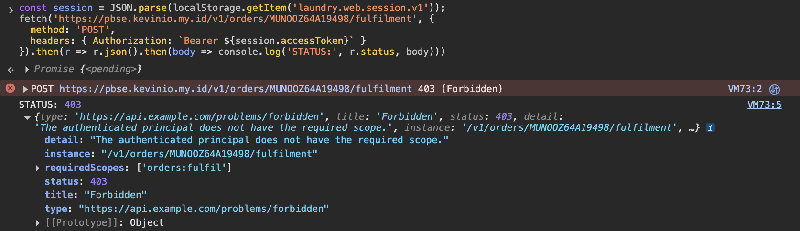
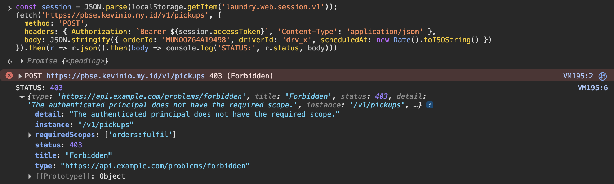
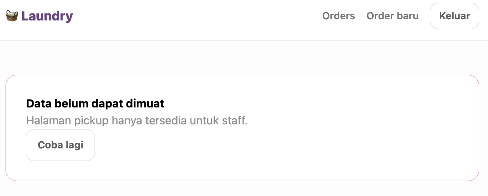
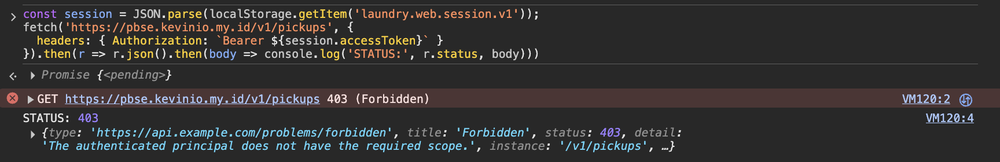
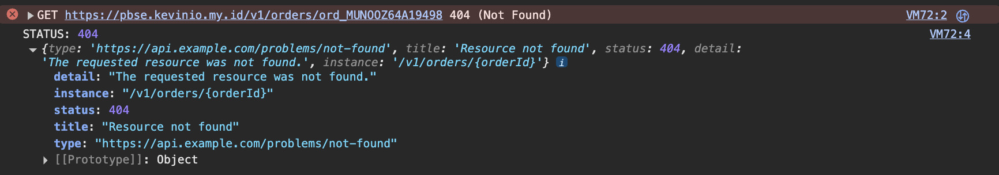
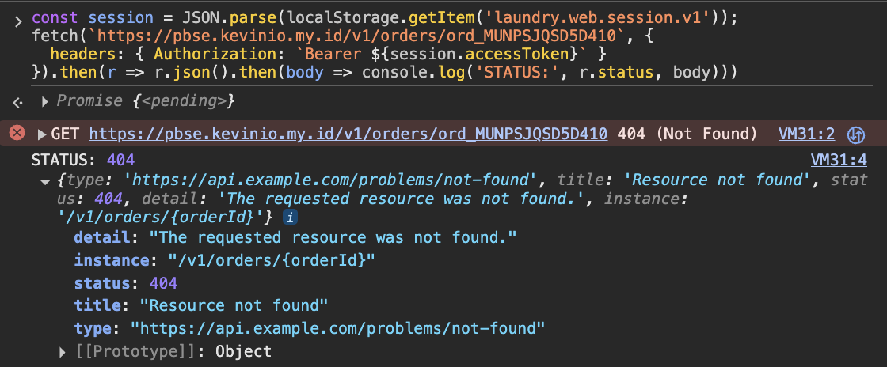
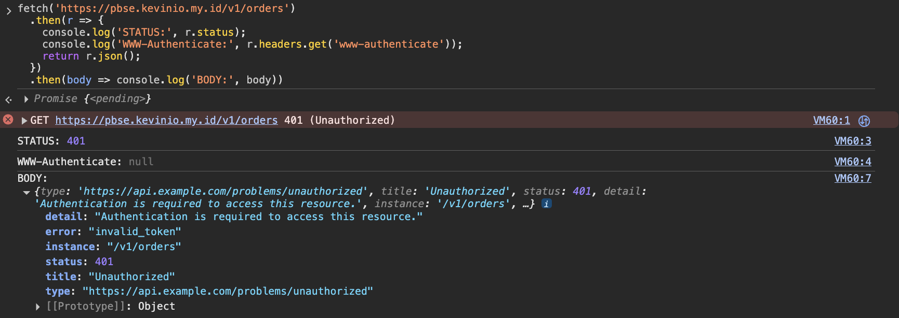

# P5 — A.9 Live Test: Attack Your Own Application

**Tester**: Tori (Integration Owner)
**Target**: https://pbse-laundry.kevinio.my.id
**Backend**: https://pbse.kevinio.my.id
**Tanggal**: 30 September 2026
**Akun uji**: student-a, student-b, staff-outlet-a, staff-outlet-b

---

## Ringkasan

Seluruh 6 skenario A.9 dijalankan langsung dari console browser
terhadap aplikasi dan service yang benar-benar ter-deploy (bukan Prism mock,
bukan localhost). Seluruh operasi yang seharusnya ditolak memang ditolak oleh service, bukan
hanya disembunyikan di sisi client.

## Hasil per Skenario

### Skenario 1 — student-a memanggil operasi staff (fulfilment)

**Request**:
```javascript
fetch('https://pbse.kevinio.my.id/v1/orders/{orderId}/fulfilment', {
  method: 'POST',
  headers: { Authorization: `Bearer ${accessToken}` }
})
```

**Hasil**: `403 Forbidden`
```json
{
  "type": "https://api.example.com/problems/forbidden",
  "title": "Forbidden",
  "status": 403,
  "detail": "The authenticated principal does not have the required scope.",
  "instance": "/v1/orders/{orderId}/fulfilment",
  "requiredScopes": ["orders:fulfil"]
}
```

✅ **PASS:** ditolak dengan scope yang hilang disebutkan eksplisit.



---

### Skenario 2 — student-a memanggil operasi dispatch pickup

**Request**:
```javascript
fetch('https://pbse.kevinio.my.id/v1/pickups', {
  method: 'POST',
  headers: { Authorization: `Bearer ${accessToken}`, 'Content-Type': 'application/json' },
  body: JSON.stringify({ orderId: '...', driverId: '...', scheduledAt: '...' })
})
```

**Hasil**: `403 Forbidden`
```json
{
  "type": "https://api.example.com/problems/forbidden",
  "title": "Forbidden",
  "status": 403,
  "detail": "The authenticated principal does not have the required scope.",
  "instance": "/v1/pickups",
  "requiredScopes": ["orders:fulfil"]
}
```

✅ **PASS**



**Catatan**: pada percobaan pertama, request menghasilkan `401` karena access
token sudah kedaluwarsa (umur token pendek, sesuai desain). Setelah reload
halaman untuk memperbarui token, percobaan ulang menghasilkan `403` yang
benar.

---

### Skenario 3 — student-a membuka `/pickups` langsung di address bar

**Aksi**: navigasi langsung ke `https://pbse-laundry.kevinio.my.id/pickups`

**Hasil UI**: halaman termuat (bukan blank/crash), menampilkan:
> "Data belum dapat dimuat. Halaman pickup hanya tersedia untuk staff."

**Network tab**: tidak ada request `GET /v1/pickups` terkirim; client menolak
memanggil API begitu membaca scope dari token yang tersimpan.

**Verifikasi tambahan** (memanggil API secara paksa dari console, melewati
proteksi client):
```javascript
fetch('https://pbse.kevinio.my.id/v1/pickups', {
  headers: { Authorization: `Bearer ${accessToken}` }
})
```
**Hasil**: `403 Forbidden`, `requiredScopes: ["orders:fulfil"]`

✅ **PASS:** baik client (routing guard) maupun server (scope check)
menolak akses. Client menyembunyikan sebagai UX, service tetap sebagai
penegak.




---

### Skenario 4 — staff-outlet-a membaca order outlet_b

**Setup**: order dibuat oleh student-a, diklaim (fulfilment) oleh
staff-outlet-b sehingga terikat ke `outlet_b`.

**Request** (sebagai staff-outlet-a):
```javascript
fetch('https://pbse.kevinio.my.id/v1/orders/{orderId}', {
  headers: { Authorization: `Bearer ${accessToken}` }
})
```

**Hasil**: `404 Not Found`
```json
{
  "type": "https://api.example.com/problems/not-found",
  "title": "Resource not found",
  "status": 404,
  "detail": "The requested resource was not found.",
  "instance": "/v1/orders/{orderId}"
}
```

✅ **PASS:** order milik outlet lain diperlakukan sama seperti tidak ada.



---

### Skenario 5 — student-a membaca order milik student-b

**Setup**: order dibuat oleh student-b (belum diklaim staff manapun).

**Request** (sebagai student-a):
```javascript
fetch('https://pbse.kevinio.my.id/v1/orders/{orderId}', {
  headers: { Authorization: `Bearer ${accessToken}` }
})
```

**Hasil**: `404 Not Found`

✅ **PASS:** order milik customer lain diperlakukan sama seperti tidak ada.



---

### Skenario 6 — request tanpa token ke endpoint protected

**Request**:
```javascript
fetch('https://pbse.kevinio.my.id/v1/orders')
```

**Hasil**: `401 Unauthorized`
Header `WWW-Authenticate` hadir pada response.

✅ **PASS**



---

## Kesimpulan

| # | Skenario | Expected | Actual | Status |
|---|---|---|---|---|
| 1 | student-a → operasi staff (fulfilment) | 403 | 403 | ✅ PASS |
| 2 | student-a → dispatch pickup | 403 | 403 | ✅ PASS |
| 3 | student-a → buka `/pickups` di address bar | Refusal state | Refusal state (client) + 403 (server, verifikasi manual) | ✅ PASS |
| 4 | staff-outlet-a → baca order outlet_b | 404 | 404 | ✅ PASS |
| 5 | student-a → baca order student-b | 404 | 404 | ✅ PASS |
| 6 | Request tanpa token | 401 + WWW-Authenticate | 401 + WWW-Authenticate | ✅ PASS |

**6/6 skenario lulus.** 

## Catatan

1. Access token memiliki umur pendek; dua kali percobaan (skenario 2 dan 5)
   sempat menghasilkan `401` karena token kedaluwarsa di antara skenario,
   bukan karena kegagalan proteksi. Setelah reload halaman untuk memperbarui
   token, hasil kembali sesuai ekspektasi.